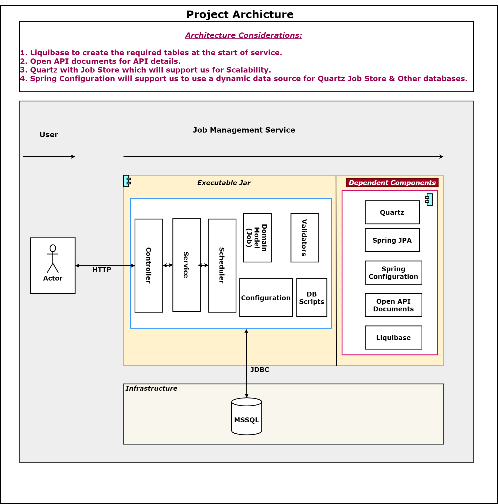

# Getting Started

### Swagger At : http://localhost:8080/jms/swagger-ui/index.html?configUrl=/jms/v3/api-docs/swagger-config#/Job%20Management/submitJob 

### Project Architecture

* Job Submission   

* Job Retrieve Job By Id 
    
* Job Retrieve All Jobs